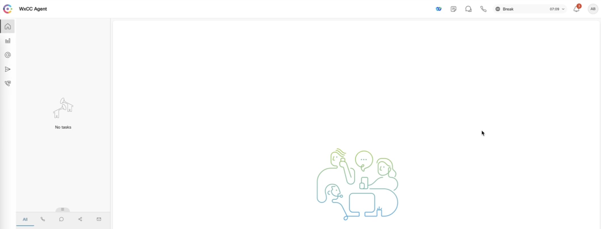
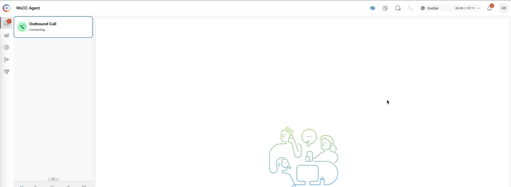

## Desktop Headless Widget
## Change State during Outdials - Dedicated outdial states

This is a simple headless widget with the idea that agents may need dedicated outdial Idle states.
The manual effort can be reduced to zero as desktop will automatically identify outdials & change agent state automatically.
The idle code can be configured by the admin within the desktop layout. 
The agent state before the outdial is preserved and the desktop moves to the prior state after the outdial completes.
Note: Disable the 'Agent available after outdial' from associated Desktop Profile

## Vidcast [Demo - Auto state change during Outdials](https://app.vidcast.io/share/29af0e97-e590-4470-8e92-373d0366eaa3)

### State before outdial


### State automatically changed on an outdial



## Try this headless widget from local env

How to run the sample widget:

**Step 1:**

_To use this widget sample, we can run it from localhost_

- Inside this project on your terminal type: `npm install`
- Then inside this project on your terminal type: `npm run dev`
- This should run the app on your localhost:3001

**Step 2:**

_Add the widget to desktop from the shared layout:_

- Download the **changeOutdialState.json_** file.
- Create a new Idle code from Control Hub and copy the Idle code ID. Ensure that the Idle code is assigned on the agents' Desktop Profile
- Update the `outdialIdleCode` in the layout file (using a text editor) to code obtained in previous step. 
- Ensure `outdialIdleCode` is updated under the widget under `headless` section for both `agent` & `supervisorAgent` sections. This'll be line number 23 and 756
- Save the layout and upload & assign to the team layout via Control Hub or Admin Portal
- Note: Layouts are configured per Agent Team.
- Sign in to Agent Desktop with the team assigned the above layout. 
- Place an outdial call to see the state change automatically. 

_Manually update the agent team layout_

- Create a new Idle code from Control Hub and copy the Idle code ID. Ensure that the Idle code is assigned on the agents' Desktop Profile
- Update the `outdialIdleCode` in the below code
- Copy the below code to the `area` section of desktop layout under `agent` and / or `supervisorAgent` profiles. Refer the shared layout.

```
"headless": {
    "id": "dw-headless",
    "widgets": {
        "comp1": {
            "comp": "outdial-state",
            "script":"http://localhost:3001/build/outdial-state.js",
            "properties": {
                "outdialIdleCode": "xxxxxxxx-yyyy-zzzz-aaaa-bbbbbbbbbb"
            }
        }
    },
    "layout": {
        "areas": [["comp1"]],
        "size": { "cols": [1], "rows": [1] }
    }
},
```


## Improve the widget:

- You can modify the widget as required.
- To create a new compiled JS file, execute the command `npm run build` which will create the new compiled widget under `.src/build/outdial-state.js`.
- You may rename this file, host it on your server of choice, and use host link under `script` in the layout.

## Useful Links - Supplemental Resources

[Desktop JS SDK Official Guide](https://developer.webex-cx.com/documentation/guides/desktop)

['Edit a Desktop Layout' section in the Administration Guide](https://help.webex.com/en-us/article/n5595zd/Webex-Contact-Center-Setup-and-Administration-Guide)

[Desktop Widgets Live Demo](https://ciscodevnet.github.io/webex-contact-center-widget-starter/)

## Disclaimer

> This is just a sample POC widget to demo the headless widget and not meant to be production ready.
> This demo showcases the possibilities of Desktop SDK and helps to identify & implement use cases. 
.